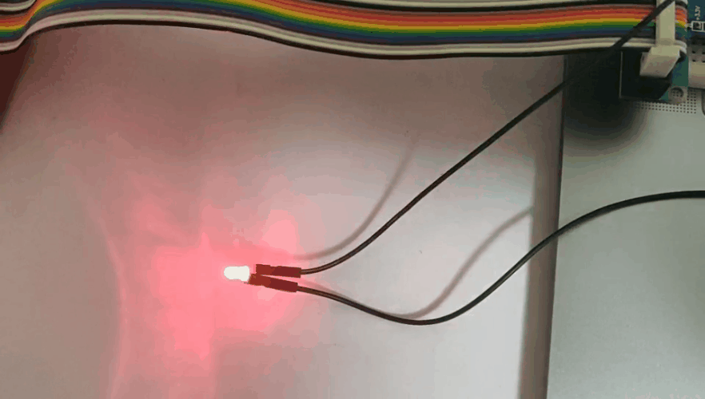

>编程工具：VSCODE ，安装插件Remote-SSH

>编程语言：nodejs

# 硬件连接
小灯泡接入p22针脚，没找到电阻，直连将就一下。

```javascript
const Gpio = require('onoff').Gpio;
const led = new Gpio(22, 'off');
setInterval(() => {
    led.writeSync(led.readSync() ? 0 : 1)
}, 200)
```





